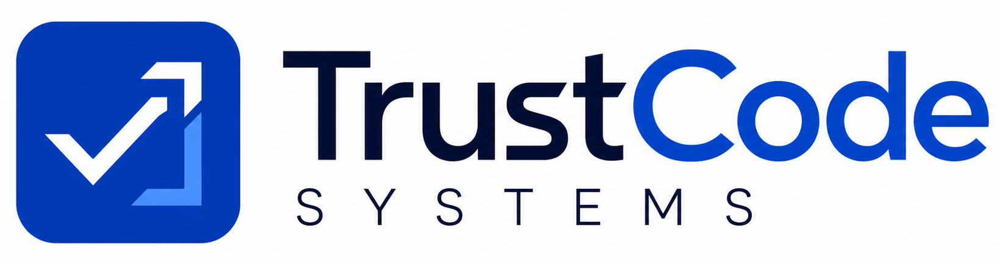

  

<h1 align="center">Software you can stake your business on.</h1>

  TrustCode Systems is a four-engineer product and technology team in Lagos and
  London. We design, build, secure, deploy, and support production software for
  teams worldwide.

  <a href="https://trustcodesystems.com">Website</a> ·
  <a href="https://trustcodesystems.com/work">Live work</a> ·
  <a href="https://trustcodesystems.com/services">Services</a> ·
  <a href="https://trustcodesystems.com/contact">Start a project</a>

## What we build

- **Product and web engineering**: websites, SaaS platforms, dashboards, admin
  systems, authentication, and role-based workflows.
- **Cloud and DevOps**: AWS CDK, Lambda, Fargate, EventBridge, CI/CD,
  infrastructure as code, caching, and cost optimization.
- **AI integration and automation**: LLM features, copilots, agents, MCP tools,
  chatbots, and workflow automation.
- **Cybersecurity and SOC services**: Sentinel, Splunk, threat hunting,
  phishing readiness, incident response, and MITRE ATT&CK reporting.
- **E-commerce**: storefronts, carts, custom orders, wholesale flows, Paystack,
  and Stripe.
- **Managed IT and training**: monitoring, maintenance, technical support,
  security awareness, and engineering mentorship.

## Production proof

Our team has shipped **15+ live products** across fintech, education,
e-commerce, HR technology, AI, cloud infrastructure, Web3, and energy.

| Project | Outcome | Stack |
| --- | --- | --- |
| [The Thesis Desk](https://thethesisdesk.xyz) | Trading command center for a 500+ member community | Next.js, TypeScript, WebSockets, PostgreSQL |
| [Helping Tribe Academy](https://helpingtribeacademy.com) | Three role-based portals and a digital admissions pipeline | Next.js, Prisma, PostgreSQL |
| [Atlas HR](https://atlas-hr-fq24.vercel.app) | Multi-country HR, payroll, and AI compliance modelling | Next.js, OpenAI, PostgreSQL |
| [AirtimeVault](https://airtime-vault-plhc.vercel.app) | Airtime-to-cash wallet with KYC and fraud monitoring | Next.js, Node.js, PostgreSQL, Paystack |
| [PetroBrain](https://petro-brain-web.vercel.app) | Source-citing AI intelligence for oil and gas teams | Next.js, OpenAI, LangChain |
| [StudyCoach](https://study-coach-five.vercel.app) | AI summaries and quizzes that reduce study time | Next.js, OpenAI, LangChain |

## How we work

1. **Discover** the business, users, constraints, risks, and success measures.
2. **Design** the interface, workflows, data model, and architecture.
3. **Build** in visible increments with a staging link and weekly demos.
4. **Harden** security, performance, accessibility, and error handling.
5. **Support** the production system with monitoring and ongoing maintenance.

## Core technologies

`TypeScript` `Next.js` `React` `Node.js` `NestJS` `PostgreSQL` `Prisma`
`MongoDB` `Redis` `AWS CDK` `Lambda` `Fargate` `Docker` `GitHub Actions`
`OpenAI` `LangChain` `Microsoft Sentinel` `Splunk` `KQL` `Paystack` `Stripe`

## Team

- [Bashir Abdulah](https://github.com/Bash-Abdul) - Frontend and Product Engineering
- [Abdulhaleem Sanuth](https://github.com/Abdulhaleem-6) - Cloud and Backend Engineering
- Olamilekan Emmanuel Oyedele - Cybersecurity and SOC
- [Abass Ibrahim](https://github.com/Lingz450) - Full-Stack Delivery and Design

## Work with us

We work through fixed-scope projects, ongoing retainers, and staff augmentation.

**hello@trustcodesystems.com**  
Lagos, Nigeria · London, United Kingdom · Remote worldwide
