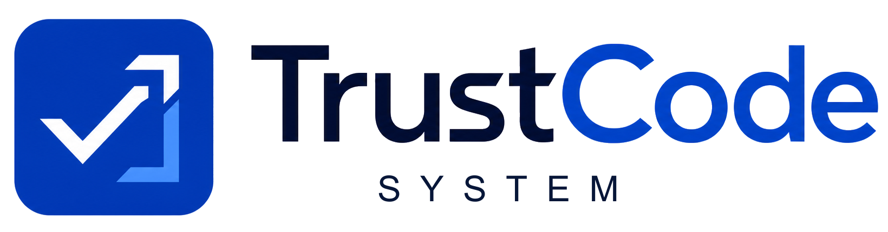
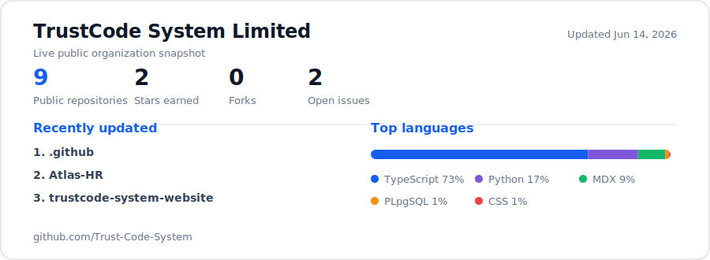

  

  

<h1 align="center">We design, build, secure, and operate production software.</h1>

  TrustCode System is a four-engineer product and technology team in Lagos and
  London. We turn business requirements into dependable digital products for
  teams worldwide.

  
  
  
  

## TrustCode at a glance

  

The snapshot above is generated from the GitHub API. A daily workflow prepares
updates for review, reporting real public organization data rather than
estimated activity.

## What we build

  
  
  
  
  
  

| Capability | What we deliver |
| --- | --- |
| **Product and web engineering** | Websites, SaaS platforms, dashboards, admin systems, authentication, and role-based workflows |
| **Cloud and DevOps** | AWS infrastructure, serverless systems, containers, CI/CD, observability, caching, and cost optimization |
| **AI integration and automation** | LLM features, copilots, agents, MCP tools, chatbots, retrieval systems, and workflow automation |
| **Cybersecurity and SOC** | Sentinel, Splunk, threat hunting, phishing readiness, incident response, and MITRE ATT&CK reporting |
| **E-commerce** | Storefronts, carts, custom orders, wholesale flows, Paystack, Stripe, and operational dashboards |
| **Managed IT and training** | Monitoring, maintenance, technical support, security awareness, and engineering mentorship |

## Production proof

Our team has shipped **15+ live products** across fintech, education,
e-commerce, HR technology, AI, cloud infrastructure, Web3, and energy.

| Project | Outcome | Stack |
| --- | --- | --- |
| [The Thesis Desk](https://thethesisdesk.xyz) | Trading command center for a 500+ member community | Next.js, TypeScript, WebSockets, PostgreSQL |
| [Helping Tribe Academy](https://helpingtribeacademy.com) | Three role-based portals and a digital admissions pipeline | Next.js, Prisma, PostgreSQL |
| [Atlas HR](https://atlas-hr-fq24.vercel.app) | Multi-country HR, payroll, and AI compliance modelling | Next.js, OpenAI, PostgreSQL |
| [AirtimeVault](https://airtime-vault-plhc.vercel.app) | Airtime-to-cash wallet with KYC and fraud monitoring | Next.js, Node.js, PostgreSQL, Paystack |
| [PetroBrain](https://petro-brain-web.vercel.app) | Source-citing AI intelligence for oil and gas teams | Next.js, OpenAI, LangChain |
| [StudyCoach](https://study-coach-five.vercel.app) | AI summaries and quizzes that reduce study time | Next.js, OpenAI, LangChain |

## Technologies we use

**Frontend and product**

  
  
  
  
  
  
  

**Backend and data**

  
  
  
  
  
  
  
  
  
  

**Cloud and delivery**

  
  
  
  
  
  
  
  
  

**AI and automation**

  
  
  

**Security and observability**

  
  
  
  
  
  

**Payments**

  
  

## How we work

1. **Discover** the business, users, constraints, risks, and success measures.
2. **Design** the interface, workflows, data model, and architecture.
3. **Build** in visible increments with a staging link and weekly demos.
4. **Harden** security, performance, accessibility, and error handling.
5. **Support** the production system with monitoring and ongoing maintenance.

## Team

| Engineer | Focus |
| --- | --- |
| [Bashir Abdulah](https://github.com/Bash-Abdul) | Frontend and Product Engineering |
| [Abdulhaleem Sanuth](https://github.com/Abdulhaleem-6) | Cloud and Backend Engineering |
| [Olamilekan Emmanuel Oyedele](https://github.com/Interleks) | Cybersecurity and SOC |
| [Abass Ibrahim](https://github.com/Lingz450) | Full-Stack Delivery and Design |

## Work with us

We work through fixed-scope projects, ongoing retainers, and staff augmentation.

  <a href="https://trustcodesystem.tech/contact"><strong>Start a project</strong></a>
  &middot;
  <a href="mailto:hello@trustcodesystem.tech">hello@trustcodesystem.tech</a>
  &middot;
  Lagos, Nigeria
  &middot;
  London, United Kingdom
  &middot;
  Remote worldwide

